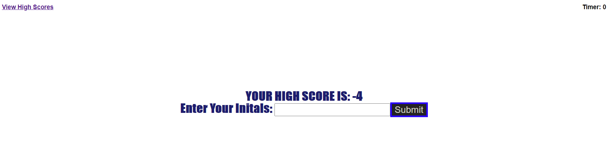
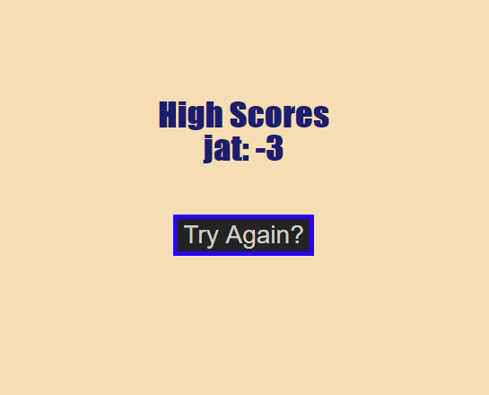

# Code-Quiz
Javascript powered Coding Quiz


# Description
The main scope of this project is to create an interactive JavaScript quiz that keeps track of the users score and stores the information in local storage

# User Story
AS A student
I WANT a way to quiz myself on imprtant JavaScript concepts in an interactive way
SO THAT I can compare my progress and compare my performance against past quizes

## Table of Contents
* [Acceptance Criteria](#Acceptance)
* [Technology](#Technology)
* [Installation](#Installation)
* [Usage](#Usage)
* [Credits](#Credits)
* [License](#License)
* [Review](#Review)


## Acceptance Criteria

```
GIVEN I am taking a code quiz
WHEN I click the start button
THEN a timer starts and I am presented with a question
WHEN I answer a question
THEN I am presented with another question
WHEN I answer a question incorrectly
THEN time is subtracted from the clock
WHEN all questions are answered or the timer reaches 0
THEN the game is over
WHEN the game is over
THEN I can save my initials and score
```

## Technology

**HTML**
<br>
**CSS**
<br>
**JS**

## Installation

To publish this web site simply download the files contained in https://github.com/jtrejox/Code-Quiz all the necesary files should be there to publish the website on your prefered web server.

<br>
<br>

## Usage

When on the main page, press the "start quiz" button to start the quiz, if you would like to see your previous "high scores", you can click on the link in the upper left corner of the screen.


When taking the quiz, simply select the answer that you think is correct.


When the answer is selected the correct answer will change color to green, while the incorrect answers will change color to red and subtract 10 seconds from the quiz timer in the upper right corner


When the timer runs out or when you have gone through all of the questions, you will be shown your score and will be propted to input your initials, click the "Submit" button to save them.


When the submit button is pressed you will be shown your score and any scores from previous attempts.


You will also be prompted to try and take the quiz again.


<Br>
<Br>

## Credits

https://www.w3schools.com/default.asp
https://stackoverflow.com/
https://www.reddit.com/

<Br>
<Br>


## License
MIT License

Copyright (c) [year] [fullname]

Permission is hereby granted, free of charge, to any person obtaining a copy
of this software and associated documentation files (the "Software"), to deal
in the Software without restriction, including without limitation the rights
to use, copy, modify, merge, publish, distribute, sublicense, and/or sell
copies of the Software, and to permit persons to whom the Software is
furnished to do so, subject to the following conditions:

The above copyright notice and this permission notice shall be included in all
copies or substantial portions of the Software.

THE SOFTWARE IS PROVIDED "AS IS", WITHOUT WARRANTY OF ANY KIND, EXPRESS OR
IMPLIED, INCLUDING BUT NOT LIMITED TO THE WARRANTIES OF MERCHANTABILITY,
FITNESS FOR A PARTICULAR PURPOSE AND NONINFRINGEMENT. IN NO EVENT SHALL THE
AUTHORS OR COPYRIGHT HOLDERS BE LIABLE FOR ANY CLAIM, DAMAGES OR OTHER
LIABILITY, WHETHER IN AN ACTION OF CONTRACT, TORT OR OTHERWISE, ARISING FROM,
OUT OF OR IN CONNECTION WITH THE SOFTWARE OR THE USE OR OTHER DEALINGS IN THE
SOFTWARE.

<br><br>

## Review

### Live url: https://jtrejox.github.io/Code-Quiz/
### GitHub url: https://github.com/jtrejox/Code-Quiz
